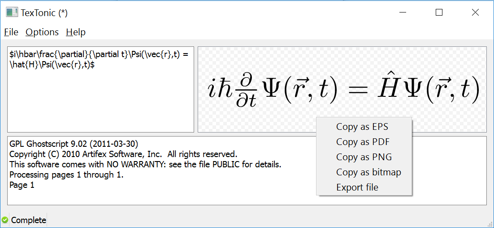

# textonic
A simple application for rendering LaTeX snippets in vector or rasterised image formats.

LaTeX renderers can be found all over the web, but not many can produce "outlined" vector image formats for import into vector graphics editors such as Illustrator or Inkscape. Script implementations exist but textonic provides a convenient GUI for generating the required files and correcting bounding boxes.

